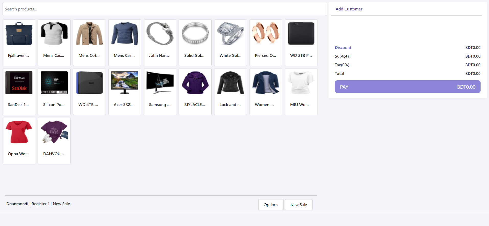
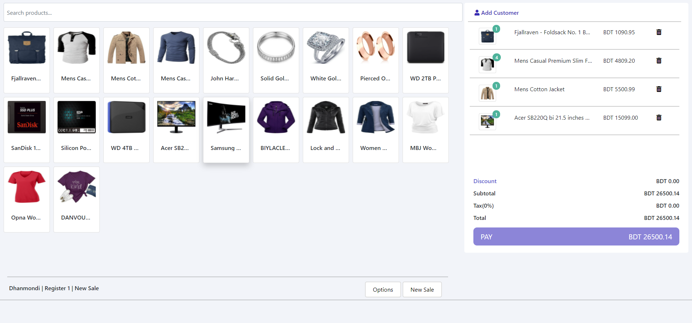
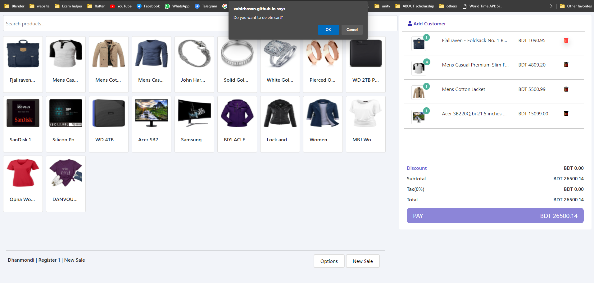
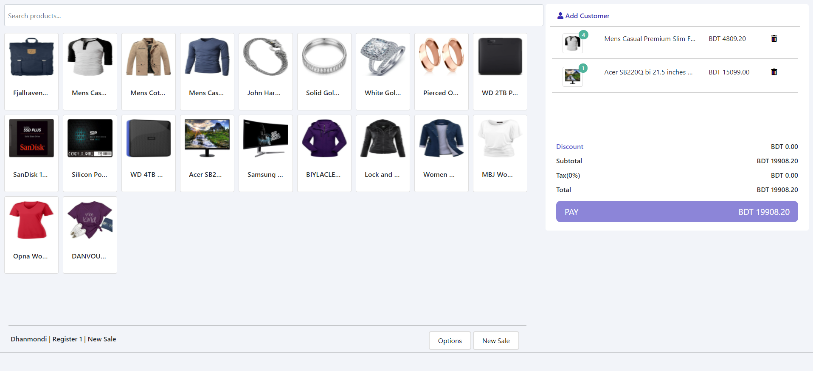

# JS Task 3
This is a simple task provided by "Qtec Careers" for my internship selection.
All values are dynamic here. You can add discount and tax also (defalut value is 0). 

live demo link: [JSTask3](https://xabirhasan.github.io/JS-Task-3/)

## Description
Name: JS Task 3  
Programming Language: JavaScript  
Platfrom: Web  
Year: 2021

## Video

## Screen shot

### Load data

### Add cart

### Delete
     

## Authors

* **AbirHasan**
Check out my other works [@XAbirHasan](https://github.com/XAbirHasan)
